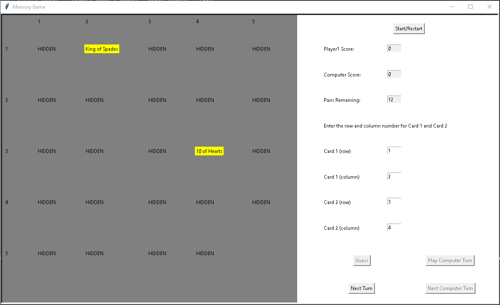

# Match-Game-Python

## About The Project
Match game with reduced cards of 24 cards. Uses breezypythongui to create window.

### Built With
[breezypythongui.py](https://lambertk.academic.wlu.edu/breezypythongui/)
